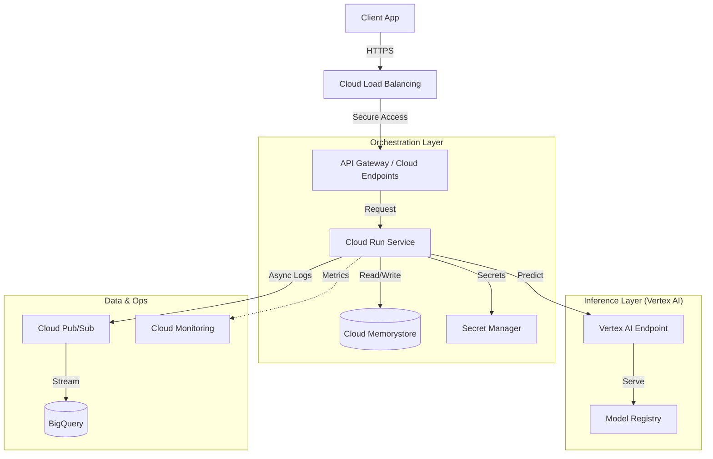

Here is a professional, high-impact `README.md` template designed to showcase your architectural and DevOps skills. You can copy and paste this directly into your repository.

---

```markdown
# Production-Ready LLM Inference Pipeline on GCP


> **Enterprise-grade LLM operations platform** designed for high availability, security, and cost-effective inference at scale using Google Cloud Vertex AI and Cloud Run.

---

## 📖 Project Overview

This repository demonstrates a **production-grade MLOps architecture** for serving Large Language Models (LLMs). Unlike simple prototype deployments, this solution focuses on the "Day 2" operational challenges of running AI in the enterprise: **Reliability, Security, and Observability.**

The system exposes a secure API for internal applications, managing the lifecycle of requests from the edge (Load Balancer) to the inference engine (Vertex AI), with caching layers and strict IAM governance.

### 🎯 Key Objectives
* **Reliability:** Zero-downtime deployments (Blue/Green) and auto-scaling compute.
* **Security:** End-to-end encryption, VPC Service Controls, and PII redaction middleware.
* **Observability:** Full tracing of "Time to First Token" (TTFT) and cost tracking per tenant.
* **Automation:** Full Infrastructure as Code (IaC) and GitOps workflows.

---

## 🏗 Architecture

The architecture follows a **hub-and-spoke model** within a Virtual Private Cloud (VPC), utilizing managed services to reduce operational overhead.



### Component Breakdown

| Component | Service | Role |
| --- | --- | --- |
| **Compute Middleware** | Cloud Run / GKE | Orchestrates requests, handles caching, PII redaction, and rate limiting. |
| **Inference Engine** | Vertex AI | Hosts the LLM (e.g., Llama 2, PaLM) with auto-scaling GPU nodes. |
| **Caching** | Cloud Memorystore (Redis) | Caches common prompts/responses to reduce latency and inference costs. |
| **Gateway** | Cloud Load Balancing | Global entry point with Cloud Armor integration (DDoS protection). |
| **IaC** | Terraform | Manages 100% of the infrastructure state. |
| **Observability** | OpenTelemetry + BigQuery | Traces request lifecycles and analyzes cost/usage patterns. |

---

## 🚀 Key Features

### 1. Robust CI/CD Pipelines

* **Infrastructure:** Terraform plans are generated on Pull Requests and applied on merge via **GitHub Actions**.
* **Application:** Docker images are built via **Cloud Build**, scanned for vulnerabilities, and pushed to **Artifact Registry**.
* **Models:** Changes to model artifacts trigger a canary deployment pipeline to Vertex AI.

### 2. Security-First Design

* **Identity:** No long-lived service account keys. Uses **Workload Identity Federation** for GitHub Actions.
* **Network:** All compute resources reside in a private VPC. Ingress is restricted to the Load Balancer.
* **Governance:** Secret Manager creates a "zero-trust" environment for API keys and database credentials.

### 3. Observability & FinOps

* **Custom Metrics:** Tracks `token_count` and `inference_latency` to calculate real-time costs.
* **Dashboards:** automated setups in Cloud Monitoring for alerting on:
* High Latency (>2s)
* Error Rate (>1%)
* Cost Spikes


---

## 📂 Repository Structure

```bash
├── .github/workflows/    # CI/CD Pipelines (Terraform Plan/Apply, Docker Build)
├── infrastructure/       
│   ├── modules/          # Reusable Terraform modules (VPC, GKE, Vertex)
│   └── environments/     # Env-specific configs (dev, prod)
├── src/
│   ├── api/              # FastAPI Application (Middleware logic)
│   └── utils/            # Shared libraries (Logger, Redis Client)
├── docs/                 # Architecture Decision Records (ADRs) & Diagrams
└── tests/                # Pytest for API and integration tests

```

---

## 🛠 Getting Started

### Prerequisites

* Google Cloud Platform Project
* Terraform v1.5+
* GCloud CLI
* Python 3.9+

### Local Development

1. **Clone the repo:**
```bash
git clone [https://github.com/your-username/gcp-llm-pipeline.git](https://github.com/your-username/gcp-llm-pipeline.git)
cd gcp-llm-pipeline

```


2. **Set up environment variables:**
```bash
cp .env.example .env
# Fill in your GCP_PROJECT_ID and SERVICE_ACCOUNT_KEY

```


3. **Run the middleware locally:**
```bash
docker-compose up --build

```


### Deployment (Terraform)

1. **Initialize Terraform:**
```bash
cd infrastructure/environments/prod
terraform init

```


2. **Plan and Apply:**
```bash
terraform plan -out=tfplan
terraform apply tfplan

```


---

## 🧠 Design Decisions (ADRs)

* **[ADR-001] Vertex AI vs. GKE:** We chose Vertex AI for the model layer to reduce operational overhead on GPU driver management, while keeping the middleware on Cloud Run for scale-to-zero cost savings.
* **[ADR-002] Caching Strategy:** Implemented "Semantic Caching" using Redis to return identical responses for semantically similar prompts, reducing Vertex AI API costs by ~15%.

---

## 📈 Future Roadmap

* [ ] Implement Vector Search for RAG (Retrieval Augmented Generation) context injection.
* [ ] Add LangChain integration for multi-step agent workflows.
* [ ] Enhance "FinOps" dashboard with per-user token quotas.

---

## 🤝 Contact & Portfolio

**Created by Oscar Mora** *Cloud | DevOps | SRE Engineer* [[LinkedIn Profile]](https://www.linkedin.com/in/oscar-m-921568a1/) 

```

```
